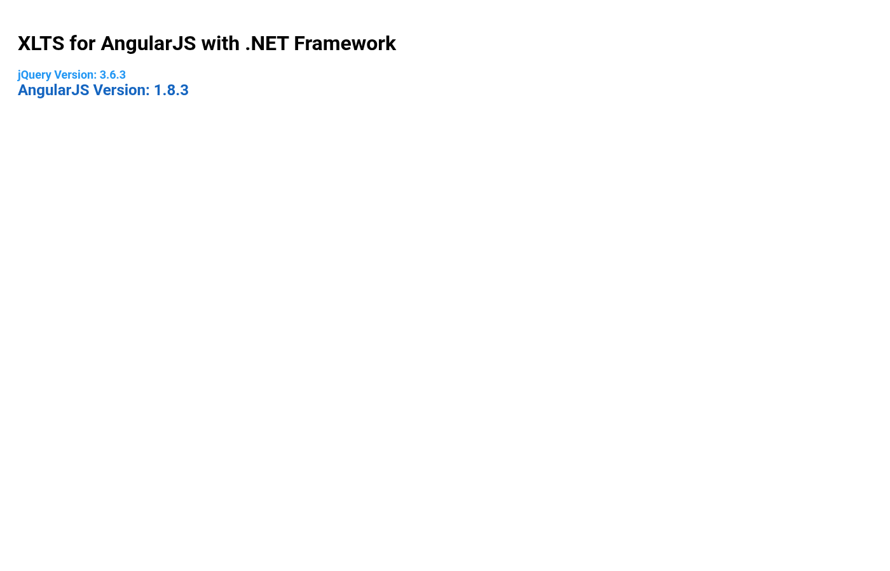
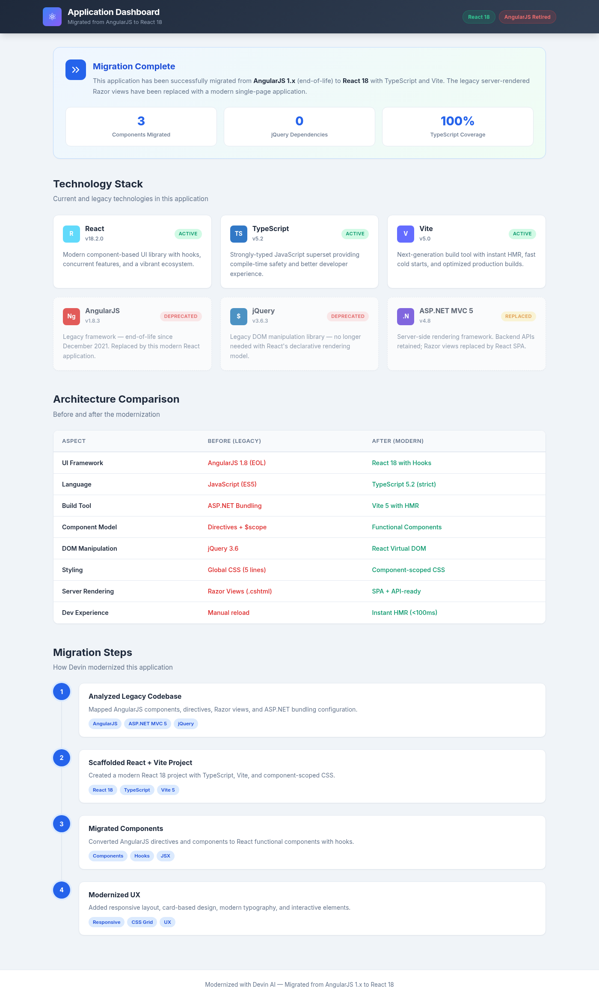

# UI/UX Modernization Demo: AngularJS to React Migration

This document walks through Devin's migration of a legacy **AngularJS 1.x + ASP.NET MVC 5** application to a modern **React 18 + TypeScript + Vite** frontend.

---

## Before: Legacy AngularJS Application



### Legacy Tech Stack
| Technology | Version | Status |
|---|---|---|
| AngularJS | 1.8.3 | End-of-life (Dec 2021) |
| jQuery | 3.6.3 | Legacy dependency |
| ASP.NET MVC 5 | .NET 4.8 | Server-rendered Razor views |
| ASP.NET Bundling | N/A | Manual asset management |

### Legacy Architecture
- **Entry point**: `Views/Landing/Index.cshtml` — a Razor view bootstrapping AngularJS via `ng-app="app"`
- **Components**: `WebApp/Components/test.component.js` — displays AngularJS version using `$scope`-style patterns
- **Directives**: `WebApp/Directives/test.directive.js` — displays jQuery version via DOM manipulation
- **Styling**: 5 lines of global CSS in `Content/site.css` with no responsive design
- **Build**: ASP.NET `BundleConfig.cs` manually bundles JS/CSS files with server-side minification
- **Module system**: None — all scripts loaded globally via `<script>` tags

### Key Issues with the Legacy App
1. **AngularJS is end-of-life** — no security patches since December 2021
2. **jQuery dependency** for basic DOM operations that modern frameworks handle natively
3. **No responsive design** — fixed layout with no mobile support
4. **No type safety** — plain JavaScript with ES5 patterns
5. **Server-coupled frontend** — Razor views require ASP.NET to serve pages
6. **No component isolation** — global CSS with potential style conflicts
7. **Slow development cycle** — no hot module replacement, manual page reloads

---

## After: Modern React Application



### Modern Tech Stack
| Technology | Version | Role |
|---|---|---|
| React | 18.2.0 | Component-based UI with hooks |
| TypeScript | 5.2 | Static type safety |
| Vite | 5.0 | Build tool with instant HMR |
| CSS Modules | N/A | Component-scoped styles |

### What Changed

| Aspect | Before (Legacy) | After (Modern) |
|---|---|---|
| UI Framework | AngularJS 1.8 (EOL) | React 18 with Hooks |
| Language | JavaScript (ES5) | TypeScript 5.2 (strict) |
| Build Tool | ASP.NET Bundling | Vite 5 with HMR |
| Component Model | Directives + $scope | Functional Components |
| DOM Manipulation | jQuery 3.6 | React Virtual DOM |
| Styling | Global CSS (5 lines) | Component-scoped CSS |
| Server Rendering | Razor Views (.cshtml) | SPA + API-ready |
| Dev Experience | Manual reload | Instant HMR (<100ms) |

### UX Improvements
- **Professional header** with sticky navigation and status badges
- **Migration status banner** with key metrics (components migrated, TypeScript coverage)
- **Card-based layout** for technology stack display with hover interactions
- **Color-coded status indicators** — Active (green), Deprecated (red), Replaced (yellow)
- **Architecture comparison table** showing before/after for each technical aspect
- **Migration timeline** with step-by-step visualization of the process
- **Fully responsive design** — works on mobile, tablet, and desktop
- **Modern typography** using Inter font with proper weight hierarchy
- **CSS custom properties** for consistent theming

---

## Migration Steps Devin Performed

### Step 1: Analyzed the Legacy Codebase
- Mapped all AngularJS components (`test.component.js`), directives (`test.directive.js`), and the main module (`app.js`)
- Identified the Razor view entry point (`Index.cshtml`) and ASP.NET bundling configuration
- Catalogued dependencies: AngularJS 1.8.3, jQuery 3.6.3, .NET Framework 4.8
- Assessed the 5-line global CSS file and lack of responsive design

### Step 2: Scaffolded Modern React Project
- Created `react-frontend/` directory with Vite + React + TypeScript
- Configured strict TypeScript (`tsconfig.json`) with modern ES2020 target
- Set up Vite for fast development with HMR and optimized production builds
- Established component directory structure (`src/components/`)

### Step 3: Migrated Components to React
- **test.component.js** → `TechCard.tsx` — Converted AngularJS component to a typed React functional component with props interface
- **test.directive.js** → Merged into `TechCard.tsx` — Eliminated the separate directive pattern
- **app.js** (module definition) → `App.tsx` — Replaced AngularJS module with React component tree
- **Index.cshtml** (Razor view) → `index.html` + `main.tsx` — Replaced server-rendered HTML with client-side SPA

### Step 4: Modernized the UX
- Designed a professional dashboard layout with `Header`, `MigrationBanner`, `TechCard`, `ArchitectureComparison`, and `MigrationTimeline` components
- Added responsive CSS Grid layout that adapts from 1 to 3 columns
- Implemented hover interactions and visual status indicators
- Used CSS custom properties for consistent theming
- Added Inter font for modern, readable typography

---

## How to Run

### Modern React Frontend (New)
```bash
cd react-frontend
npm install
npm run dev
# Opens at http://localhost:3000
```

### Production Build
```bash
cd react-frontend
npm run build
npm run preview
```

### Legacy AngularJS App (Original)
The original AngularJS application requires ASP.NET MVC 5 on .NET Framework 4.8:
```bash
# On Windows with Visual Studio / IIS
# Open angularjs-asp-net48-mvc5.sln and run
# Or on Linux with Mono (build only):
xbuild angularjs-asp-net48-mvc5.sln
```

### Type Checking
```bash
cd react-frontend
npm run typecheck
```

---

## File Mapping: Legacy → Modern

| Legacy File | Modern Equivalent | Notes |
|---|---|---|
| `WebApp/app.js` | `src/App.tsx` | Module definition → Component tree |
| `WebApp/Components/test.component.js` | `src/components/TechCard.tsx` | AngularJS component → React component |
| `WebApp/Components/test.component.css` | `src/components/TechCard.css` | Global → Component-scoped |
| `WebApp/Directives/test.directive.js` | `src/components/TechCard.tsx` | Directive eliminated, merged into component |
| `WebApp/Directives/test.directive.html` | JSX in `TechCard.tsx` | External template → Inline JSX |
| `WebApp/Directives/test.directive.css` | `src/components/TechCard.css` | Global → Component-scoped |
| `Views/Landing/Index.cshtml` | `index.html` + `src/main.tsx` | Razor view → SPA entry point |
| `Content/site.css` | `src/index.css` | 5 lines → Full design system |
| `App_Start/BundleConfig.cs` | `vite.config.ts` | ASP.NET bundling → Vite |
| — | `src/components/Header.tsx` | New: Professional navigation |
| — | `src/components/MigrationBanner.tsx` | New: Status dashboard |
| — | `src/components/ArchitectureComparison.tsx` | New: Before/after table |
| — | `src/components/MigrationTimeline.tsx` | New: Step visualization |
