# Migration Diagram: ASP.NET MVC 5 to ASP.NET Core 7 Web API

## Architecture Overview

```mermaid
graph TB
    subgraph "BEFORE: ASP.NET MVC 5 (.NET Framework 4.8)"
        subgraph "MVC5[ASP.NET MVC 5 Application]"
            GlobalAsax["Global.asax<br/>(Application Start)"]
            WebConfig["Web.config<br/>(Configuration)"]
            AppStart["App_Start<br/>(Routing/Bundles)"]
            
            subgraph "MVC Components"
                LandingController["LandingController<br/>(MVC Controller)"]
                RazorView["Landing/Index.cshtml<br/>(Razor View)"]
            end
        end
        
        subgraph "Frontend1[AngularJS Frontend]"
            WebApp1["WebApp/<br/>(app.js, components)"]
            Content1["Content/<br/>(CSS files)"]
            NodeModules1["node_modules/<br/>(jQuery, AngularJS)"]
        end
        
        LandingController -->|Server-side Rendering| RazorView
        RazorView -->|Embedded Scripts/Styles| Frontend1
    end
    
    subgraph "AFTER: ASP.NET Core 7 Web API (.NET 8.0)"
        subgraph "Core[ASP.NET Core Web API]"
            ProgramCs["Program.cs<br/>(Application Start & Middleware)"]
            AppSettings["appsettings.json<br/>(Configuration)"]
            
            subgraph "API Components"
                ApiController["ApiController<br/>(JSON API)"]
                LandingApiController["LandingApiController<br/>(JSON API)"]
            end
            
            subgraph "Static Files"
                StaticMiddleware["Static File Middleware"]
                IndexHtml["wwwroot/index.html<br/>(Static HTML)"]
                CorsPolicy["CORS Policy<br/>(AllowAngularJS)"]
            end
        end
        
        subgraph "Frontend2[AngularJS Frontend]"
            WebApp2["WebApp/<br/>(app.js, components)"]
            Content2["Content/<br/>(CSS files)"]
            NodeModules2["node_modules/<br/>(jQuery, AngularJS)"]
        end
        
        StaticMiddleware -->|Serves Static Files| IndexHtml
        IndexHtml -->|References| Frontend2
        Frontend2 -->|CORS-enabled API Calls| ApiController
        Frontend2 -->|CORS-enabled API Calls| LandingApiController
    end

    classDef beforeStyle fill:#ffebee,stroke:#c62828,stroke-width:2px
    classDef afterStyle fill:#e8f5e8,stroke:#2e7d32,stroke-width:2px
    classDef frontendStyle fill:#e3f2fd,stroke:#1565c0,stroke-width:2px
    
    class MVC5,GlobalAsax,WebConfig,AppStart,LandingController,RazorView beforeStyle
    class Core,ProgramCs,AppSettings,ApiController,LandingApiController,StaticMiddleware,IndexHtml,CorsPolicy afterStyle
    class Frontend1,Frontend2,WebApp1,WebApp2,Content1,Content2,NodeModules1,NodeModules2 frontendStyle
```

## Key Changes

1. **Project Structure**:
   - Replaced legacy `.csproj` with SDK-style project format
   - Migrated from .NET Framework 4.8 to .NET 8.0
   - Replaced NuGet packages with .NET Core equivalents

2. **Configuration**:
   - Replaced `Web.config` with `appsettings.json`
   - Configured middleware in `Program.cs` instead of `Global.asax`
   - Added CORS policy for frontend communication

3. **Controllers**:
   - Converted MVC Controllers to API Controllers
   - Changed from returning Views to returning JSON data
   - Added `[ApiController]` attribute

4. **Frontend Integration**:
   - Replaced server-side Razor views with static HTML
   - Configured static file middleware to serve frontend assets
   - Implemented CORS to allow API communication

5. **Bundling/Minification**:
   - Removed `BundleConfig.cs` bundling
   - Directly referenced individual files in HTML

## Technology Stack Comparison

| Component | Before | After |
|-----------|--------|-------|
| Framework | .NET Framework 4.8 | .NET 8.0 |
| Web Framework | ASP.NET MVC 5 | ASP.NET Core 7 Web API |
| Configuration | Web.config | appsettings.json |
| Startup | Global.asax | Program.cs |
| Controllers | MVC Controllers | API Controllers |
| Views | Razor Views | Static HTML |
| Frontend | AngularJS | AngularJS (unchanged) |
| Communication | Server-side rendering | JSON API + CORS |
